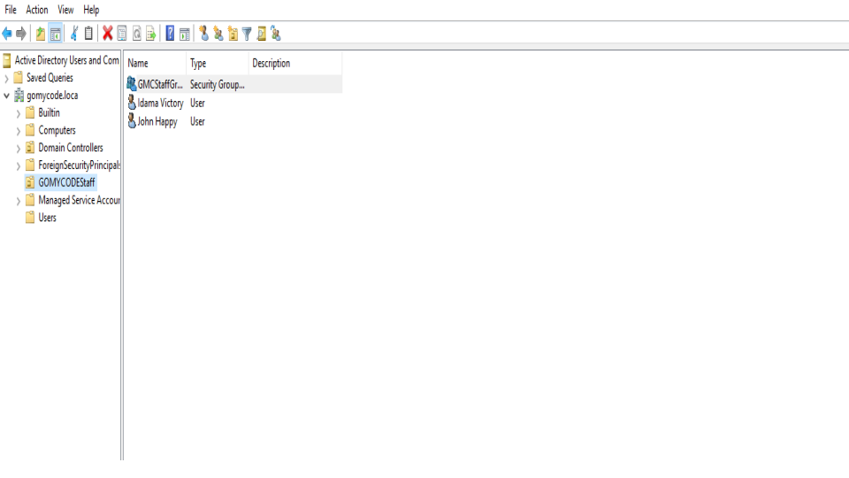
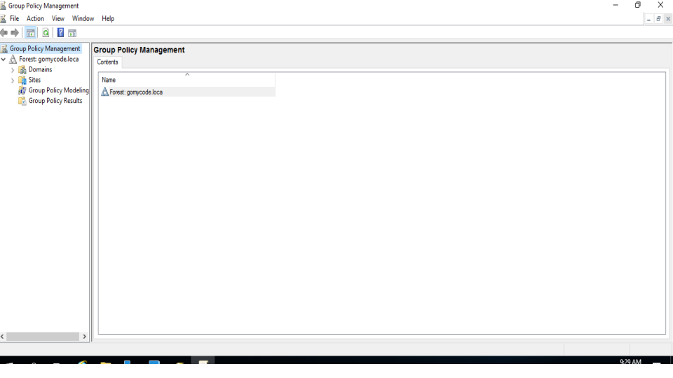
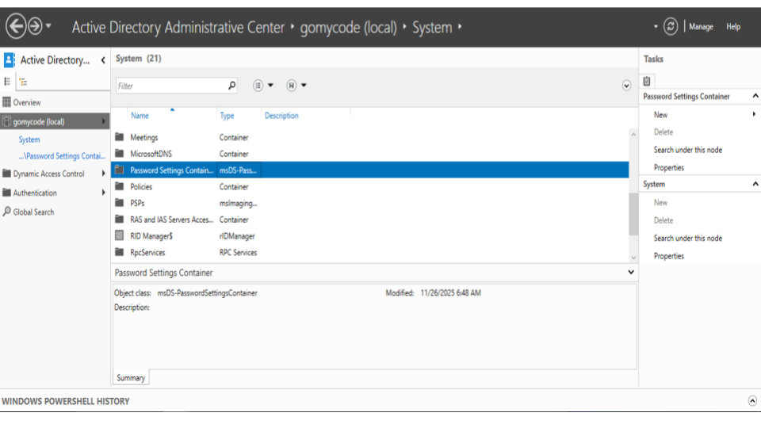

# 🛡️ Active Directory Basics Lab

## 📌 Project Overview

This project documents my hands-on learning experience with the fundamentals of Microsoft Active Directory in a Windows enterprise environment.

The objective of this lab was to understand how centralized identity and access management works in corporate networks, as well as how administrators manage users, systems, permissions, and policies across domains

Active Directory is one of the most important technologies used in enterprise environments and is heavily relied upon in both defensive and offensive cybersecurity operations.

## 🎯 Objectives

During this project, I explored and learned:

- Active Directory fundamentals
- Windows Domains
- Organizational Units (OUs)
- Trees and Forests
- Users, Groups, and Computer Objects
- Group Policy Objects (GPOs)
- Authentication concepts
- Domain Trust Relationships

## 🧠 Skills Learned

### 🔹 Active Directory Structure
- Domains
- Trees
- Forests
- Organizational Units (OUs)

### 🔹 Identity & Access Management
- User Accounts
- Computer Accounts
- Security Groups

### 🔹 Windows Administration
- Group Policy Management
- Domain Administration Concepts

### 🔹 Authentication & Security
- Kerberos Authentication
- Trust Relationships between Domains

## 🛠️ Technologies Used

- Windows Server
- Active Directory Domain Services (AD DS)
- Windows Enterprise Environment

## 📷 Project Completion

Successfully completed all lab tasks and exercises while gaining practical exposure to Active Directory administration concepts.

## 🚀 Key Takeaways

This project strengthened my understanding of how enterprise Windows infrastructures operate and how centralized authentication and authorization are managed.

The knowledge gained from this lab is valuable for:
- SOC Operations
- Windows Security Monitoring
- Threat Detection
- Incident Response
- Blue Team Operations
- 
### 📊 Evidence 

<h3 align="center">Active Directory Configuration</h3>

    

<h3 align="center">Configured User Accounts And Security Groups</h3>

    

<h3 align="center">Password Policy Configuration</h3>

    

<h3 align="center">Group Policy Configuration</h3>

    

<h3 align="center">Active Directory Admimistrative Center</h3>

    

All screenshots are here:

🔗 [Google Slides](https://docs.google.com/presentation/d/1BNS81NCNovSplIKuFzUSsh9rm93Uns510YfOLbmdMgQ/edit?slide=id.p#slide=id.p)

## 👨‍💻 Author

**Idama Victory**  
Cybersecurity Enthusiast | SOC Analyst Learner | Blue Team Focused

