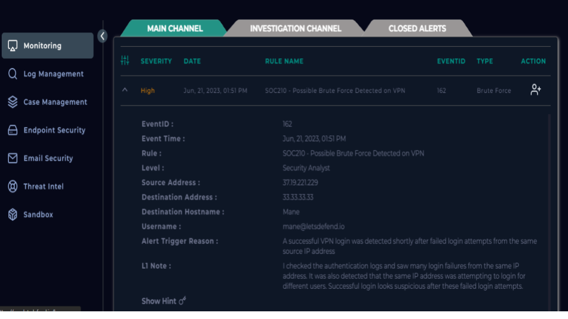
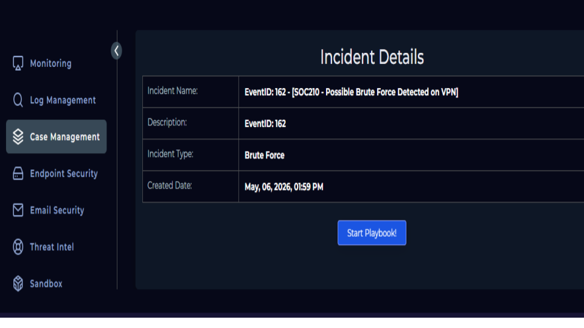
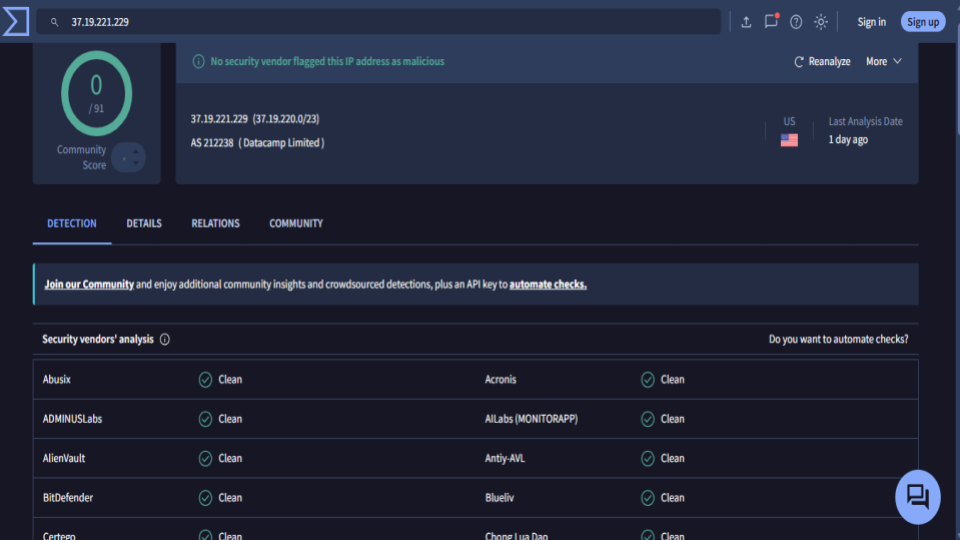
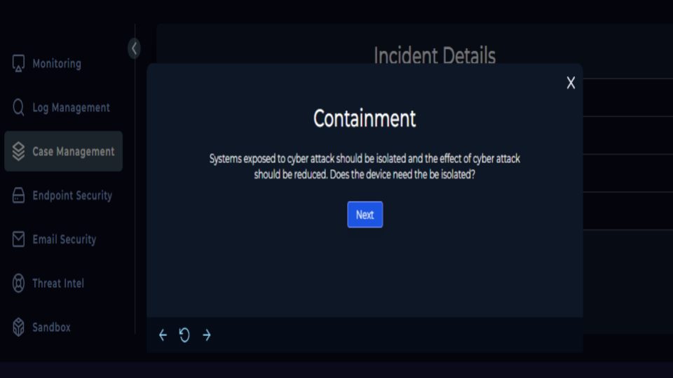
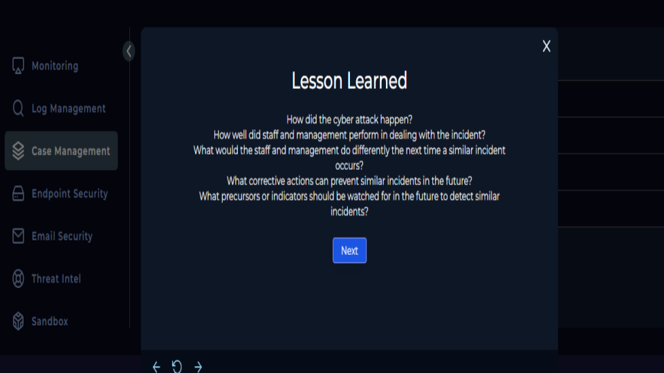
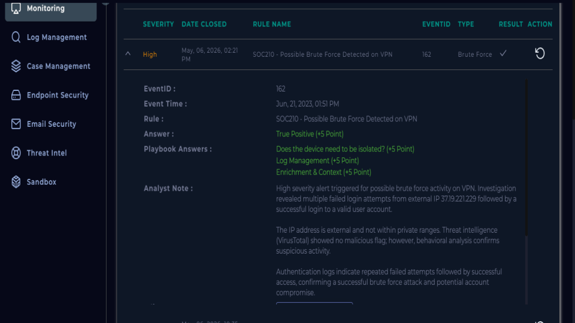

# 🛡️ Brute Force Attack Investigation

## 📌 Overview

This project documents the investigation of a **high-severity SIEM alert** indicating a potential brute force attack against a VPN service.
The analysis was conducted in a simulated SOC environment using LetsDefend.

The objective was to determine:

* Whether the alert was a true threat
* If the attack was successful
* What response actions were required

---

## 🚨 Alert Details

| Field       | Value                                           |
| ----------- | ----------------------------------------------- |
| Alert Name  | Possible Brute Force Detected on VPN            |
| Severity    | High                                            |
| Event ID    | 162                                             |
| Target User | [mane@letsdefend.io](mailto:mane@letsdefend.io) |

---

## 🌐 Indicators of Compromise (IOCs)

| Type       | Value         | Description                                                                               |
| ---------- | ------------- | ----------------------------------------------------------------------------------------- |
| IP Address | 37.19.221.229 | External IP associated with multiple failed login attempts followed by a successful login |

---

## 🔍 Investigation Methodology

### 1. IP Address Classification

* The source IP (**37.19.221.229**) was analyzed
* It does not belong to private IP ranges (RFC1918)
* Classified as an **external IP address**

📌 **Implication:** Activity originated outside the organization

---

### 2. Threat Intelligence Analysis

* The IP was analyzed using VirusTotal
* Result: **0/91 detections**

⚠️ Important:

> A clean reputation does NOT mean the activity is safe

📌 Attackers often use:

* Clean infrastructure
* Newly registered IPs
* Compromised systems

---

### 3. Log Analysis

Authentication logs revealed:

* Multiple **failed login attempts**
* Followed by a **successful login**
* Same **source IP**
* Same **user account**

📌 Pattern observed:

```
Failed → Failed → Failed → SUCCESS
```

---

### 4. Attack Validation

Based on behavioral evidence:

* Repeated failed authentication attempts
* Successful login from same IP
* External origin

✅ **Conclusion:**
This confirms a **successful brute force attack**

---

## 🚨 Incident Impact

* Unauthorized access to user account likely
* Potential for:

  * Data exfiltration
  * Privilege escalation
  * Lateral movement

---

## 🛡️ Response & Containment

### Device-Level Action

* The affected system was **isolated from the network**

### Account-Level Action

* Forced password reset
* Multi-Factor Authentication (MFA) recommended
* Active sessions terminated
* Account monitoring initiated

📌 Objective:

> Remove attacker access while preserving legitimate user access

---

## 📊 Final Verdict

| Classification | Result                |
| -------------- | --------------------- |
| Alert Type     | True Positive         |
| Attack Type    | Brute Force           |
| Outcome        | Successful Compromise |

---

## 🧠 Key Takeaways

* Behavioral analysis is more reliable than threat intelligence alone
* A successful login after repeated failures is a strong indicator of compromise
* Clean IP reputation does not guarantee benign activity
* Immediate containment is critical after confirmed compromise

---

## 🧩 SOC Workflow Demonstrated

This project follows a real-world SOC investigation lifecycle:

1. Alert Triage
2. Enrichment (IP Analysis, Threat Intel)
3. Log Analysis
4. Incident Validation
5. Containment & Response
6. Documentation

---

## 🧪 Tools Used

* LetsDefend – SOC Simulation
* VirusTotal – Threat Intelligence

### 📊 Evidence 

<h1 align="center">Reviewed and investigated a high-severity VPN brute-force alert in the SOC monitoring dashboard</h1>

<p align="center">
    
</p>

<h1 align="center">Analyzed incident details and initiated the incident response playbook for a detected brute-force attack</h1>

<p align="center">
    
</p>

<h1 align="center">Performed containment procedures to isolate affected systems and reduce attack impact</h1>

<p align="center">
    
</p>

<h1 align="center">Performed containment procedures to isolate affected systems and reduce attack impact (VirusTotal)</h1>

<p align="center">
    
</p>

<h1 align="center">Documented lessons learned and preventive recommendations after the incident response process</h1>

<p align="center">
    
</p>

<h1 align="center">Completed incident response documentation and remediation review within the SOC case management platform</h1>

<p align="center">
    
</p>

  
All screenshots are here:

🔗 [Google Slides ](https://docs.google.com/presentation/d/1f0LSHZmV_8tUpTtAJPlObI7YMWAEzJVZaGwQxYu6KrU/edit?usp=sharing)


## ⭐ Final Note

This project demonstrates practical SOC analysis skills including alert triage, log correlation, threat validation, and incident response in a simulated environment.

---
