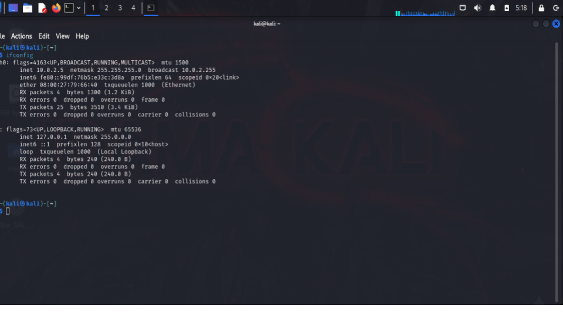
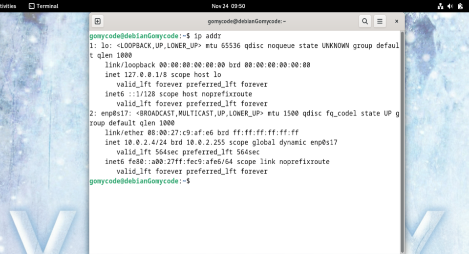
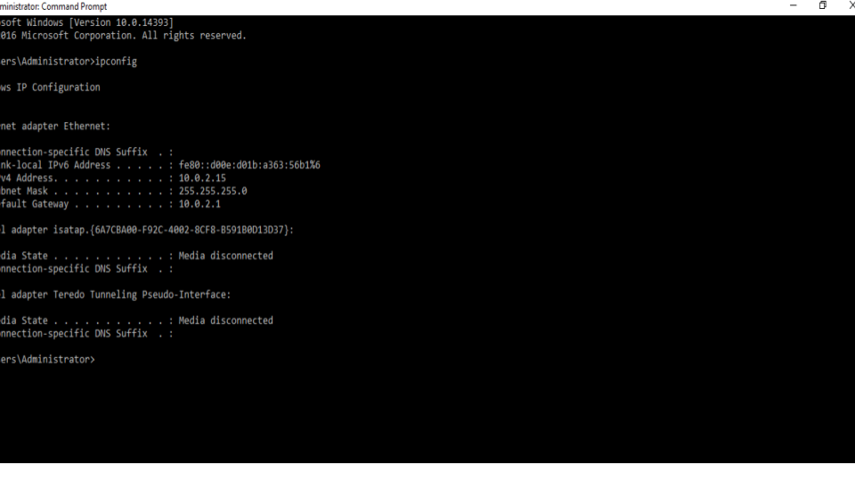
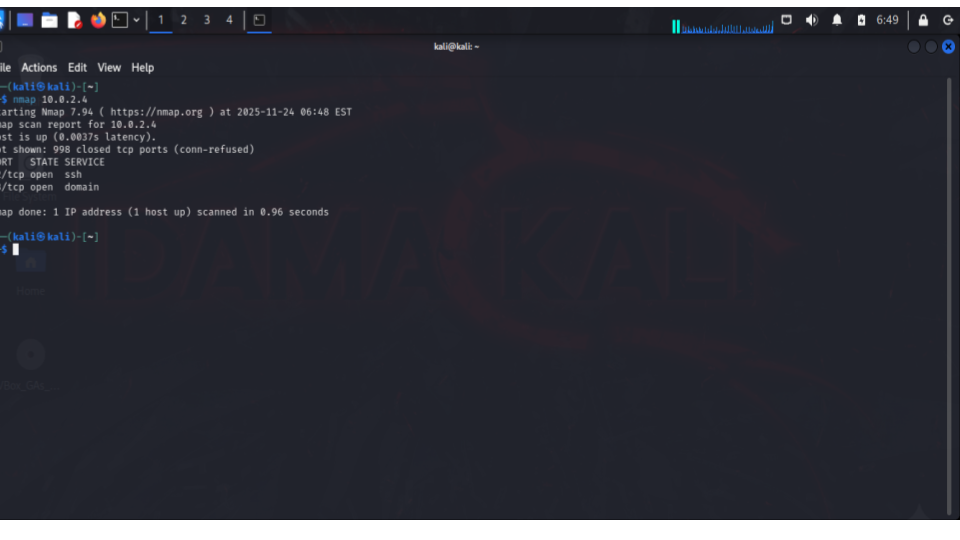
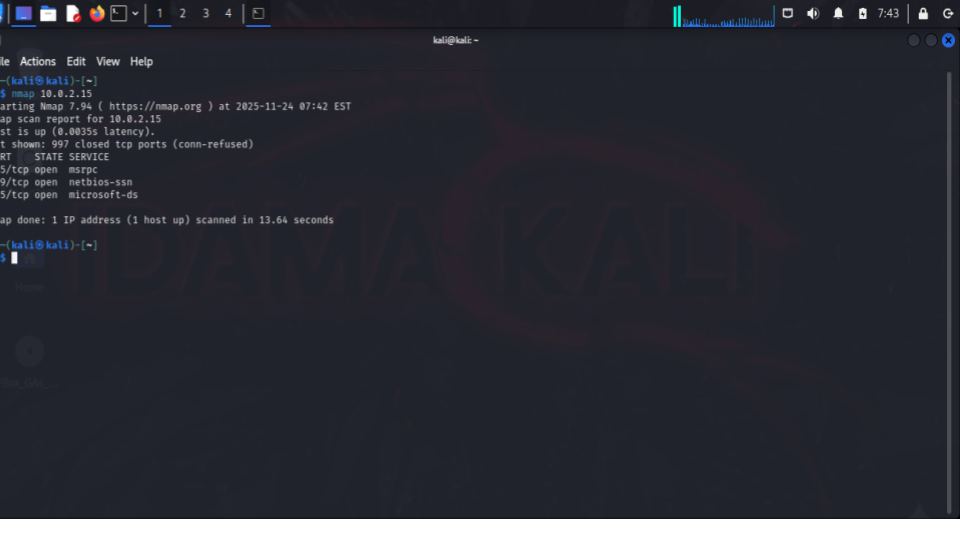
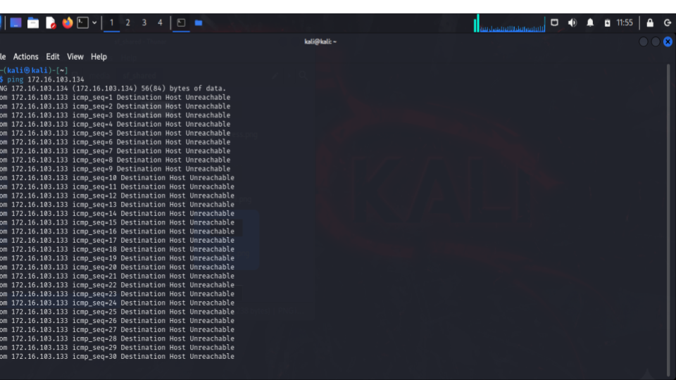
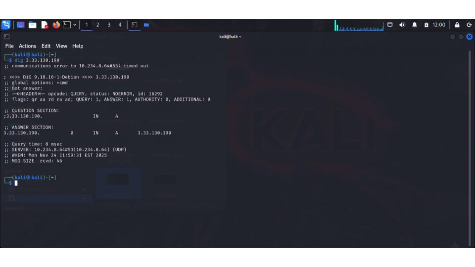

# Module 2: Networking

## Objective
To understand basic networking concepts and how devices communicate
over a network.

## Key Concepts Covered
- Types of networks (LAN, WAN, MAN)
- IP addressing and subnetting
- Network devices (router, switch, firewall)
- Common networking protocols (TCP/IP, HTTP, HTTPS, DNS)

## What I Learned
- How data moves across networks
- The role of IP addresses and ports
- Differences between TCP and UDP
- How networking knowledge supports cybersecurity operations

### 📊 Evidence 

<h3 align="center">Kali linux Ip Address , using ifconfig command</h3>

    

<h3 align="center">Debian OS IP Address , using ip addr command
</h3>

    

<h3 align="center">Windows server Ip address, using ipconfig command
</h3>

    

<h3 align="center">Using Kali to identify the different ports running on Debian</h3>

    

<h3 align="center">Using Kali to identify the different ports running on Windows server
</h3>

    

<h3 align="center">Verifying the communication with the following Ip :172.16.103.134 using ping.
</h3>

    

<h3 align="center">Identifying its FQND :using dig command
</h3>

    

All screenshots are here:

🔗 [Google Slides](https://docs.google.com/presentation/d/19vhxyDZN89SKWR4bHyCUHsV8j6NaV-QgvdVoGN8cgDs/edit?usp=sharing)

## Summary
This checkpoint strengthened my understanding of networking fundamentals,
which are essential for detecting, analyzing, and defending against cyber threats.
