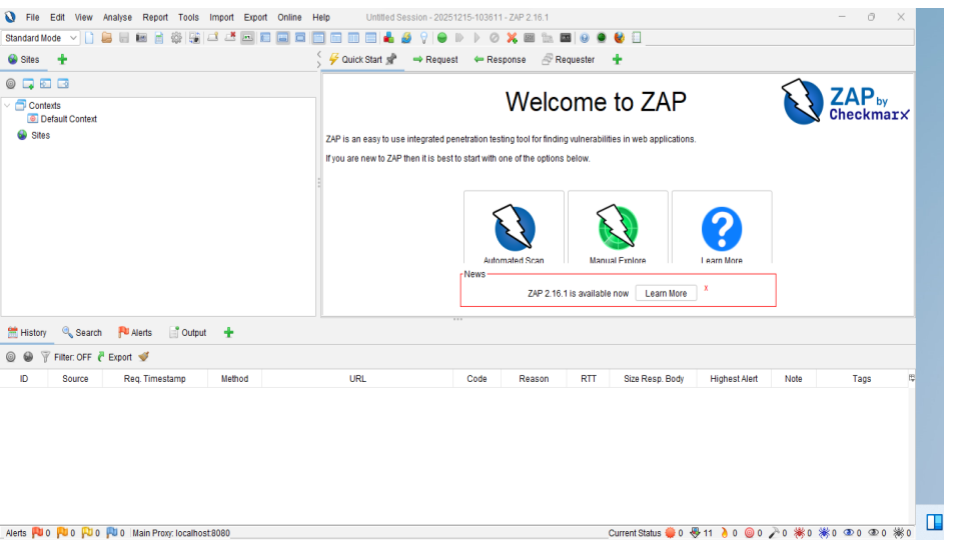
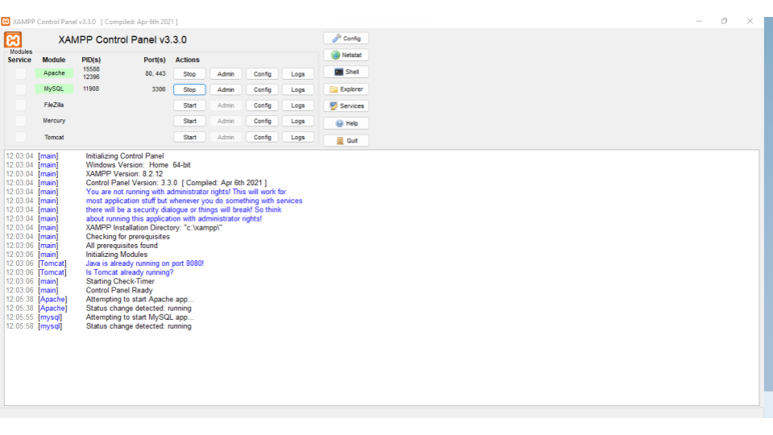
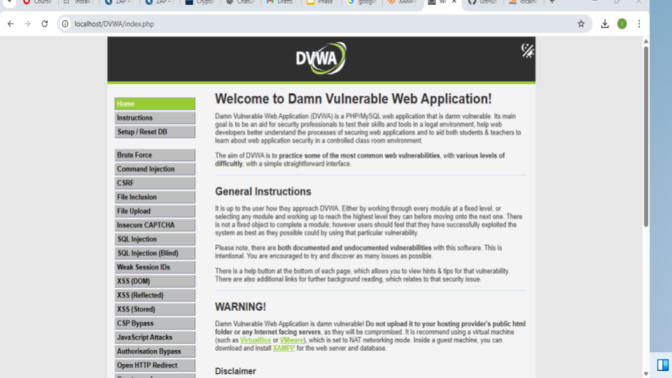
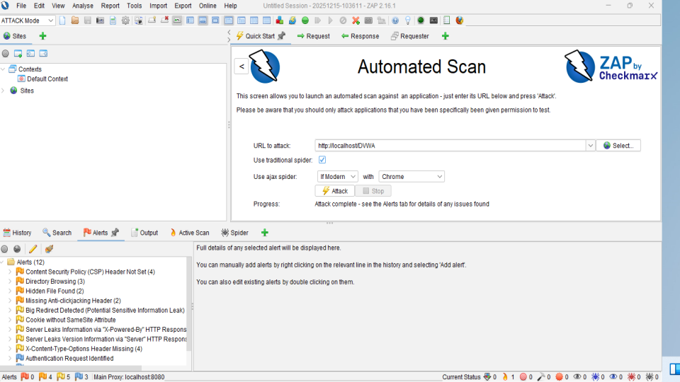

##🧠 OWASP ZAP Vulnerability Assessment Project

# 📌 Overview

This project demonstrates the setup and execution of an automated web application vulnerability assessment within a controlled lab environment.

Using the Damn Vulnerable Web Application (DVWA) hosted on a local XAMPP server, I performed security testing with OWASP ZAP (Zed Attack Proxy) to identify, analyze, and categorize common web application vulnerabilities and security misconfigurations.

The project highlights practical web application security testing, vulnerability discovery, risk prioritization, and security assessment workflows commonly used in penetration testing and SOC environments.

# 🎯 Objectives

- Deploy and configure a vulnerable web application locally
- Perform automated vulnerability scanning using OWASP ZAP
- Identify common web security weaknesses
- Analyze and categorize findings by severity
- Demonstrate practical web application security assessment skills

# 🛠️ Technical Stack

| Component | Technology |
|---|---|
| Vulnerable Target | DVWA (Damn Vulnerable Web Application) |
| Security Scanner | OWASP ZAP |
| Web Server | Apache (XAMPP) |
| Database | MySQL |
| Environment | Windows Localhost Lab |

# ⚙️ Lab Environment Setup

## 1️⃣ XAMPP Configuration

- Installed and configured XAMPP
- Enabled Apache and MySQL services
- Hosted DVWA on localhost environment
- Verified application accessibility through browser testing

### Local Target

http://localhost/dvwa

## 2️⃣ DVWA Deployment

- Extracted DVWA into XAMPP `htdocs` directory
- Configured database connectivity
- Initialized DVWA setup page
- Verified successful application deployment

# 🔍 Vulnerability Assessment Process

## OWASP ZAP Scan Execution

The assessment was performed using OWASP ZAP's automated scanning capabilities.

### Scan Workflow

1. Target URL added to OWASP ZAP
2. Spider scan executed to map application structure
3. Active scan initiated against discovered endpoints
4. Results analyzed and categorized by severity

# 🚨 Key Findings

The automated assessment identified several common web application security issues, including:

## 📂 Information Disclosure

- Server version exposure
- Directory listing exposure
- Application fingerprinting indicators

## 🛡️ Missing Security Headers

- Missing anti-clickjacking headers
- Missing content security protections
- Insecure HTTP response configurations

## ⚠️ Security Misconfigurations

- Weak default application settings
- Insecure development configurations
- Potential attack surface exposure

# 📊 Risk Categorization

| Severity | Description |
|---|---|
| 🔴 High | Critical vulnerabilities requiring immediate remediation |
| 🟠 Medium | Security weaknesses with moderate impact |
| 🟡 Low | Minor security issues and hardening recommendations |
| 🔵 Informational | Security observations and environment details |

# 🧠 Skills Demonstrated

- Web Application Security Testing
- Vulnerability Assessment
- OWASP ZAP Usage
- Attack Surface Mapping
- Risk Analysis
- Security Misconfiguration Identification
- Local Security Lab Deployment
- Basic Penetration Testing Methodology

# 🧰 Tools Used

- OWASP ZAP
- XAMPP
- DVWA
- Apache
- MySQL

# 📚 Learning Outcomes

This project provided hands-on experience in:

- Conducting automated web vulnerability assessments
- Understanding common OWASP-related weaknesses
- Interpreting vulnerability scan results
- Analyzing application security posture
- Building practical cybersecurity lab environments

### 📊 Evidence 

<h3 align="center">This screenshot shows the initial launch of OWASP ZAP (Zed Attack Proxy), a leading open-source web application security scanner</h3>

    

<h3 align="center">This image displays the XAMPP Control Panel managing the local web server environment</h3>

    

<h3 align="center">A view of the DVWA homepage hosted on localhost, used as the primary target for security exercises</h3>

    

<h3 align="center">This screenshot captures the results of an Automated Scan performed by OWASP ZAP against the DVWA target.</h3>

    

All screenshots are here:

🔗 [Google Slides](https://docs.google.com/presentation/d/1KKvLXd-_aLdZBwTUWuX_Wr0wxsYMz-Zllpsa_R20hKY/edit?usp=sharing)

# ⚠️ Disclaimer

This project was conducted strictly within a controlled local lab environment for educational and defensive security purposes only.

# 👨‍💻 Author

## Idama Victory Othuke
