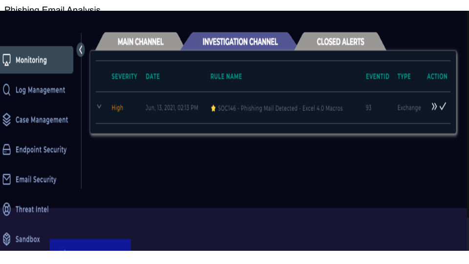
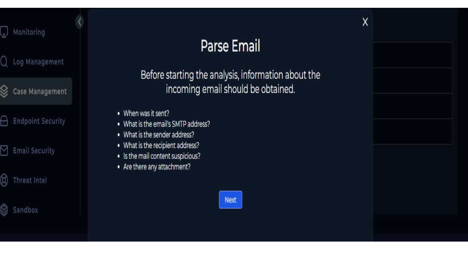
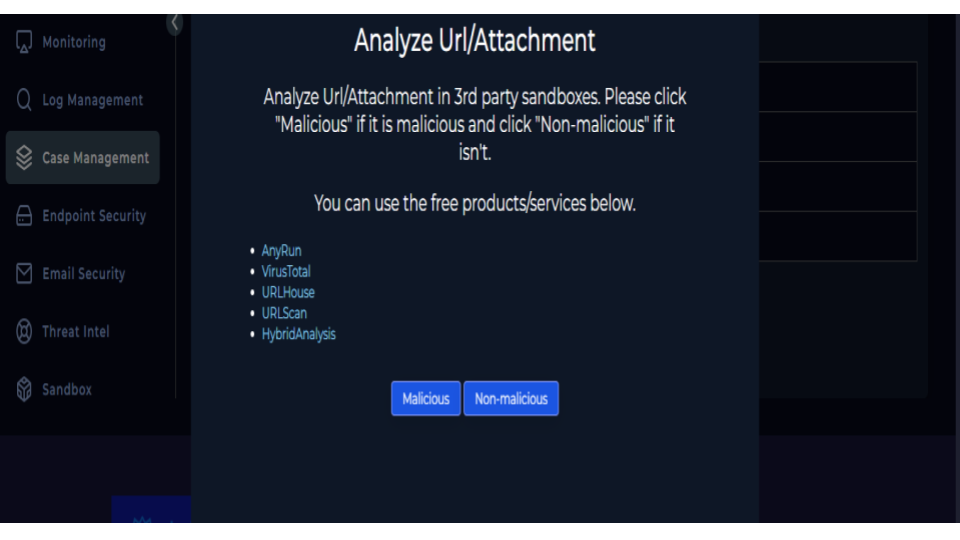
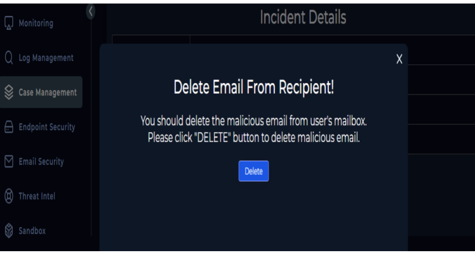
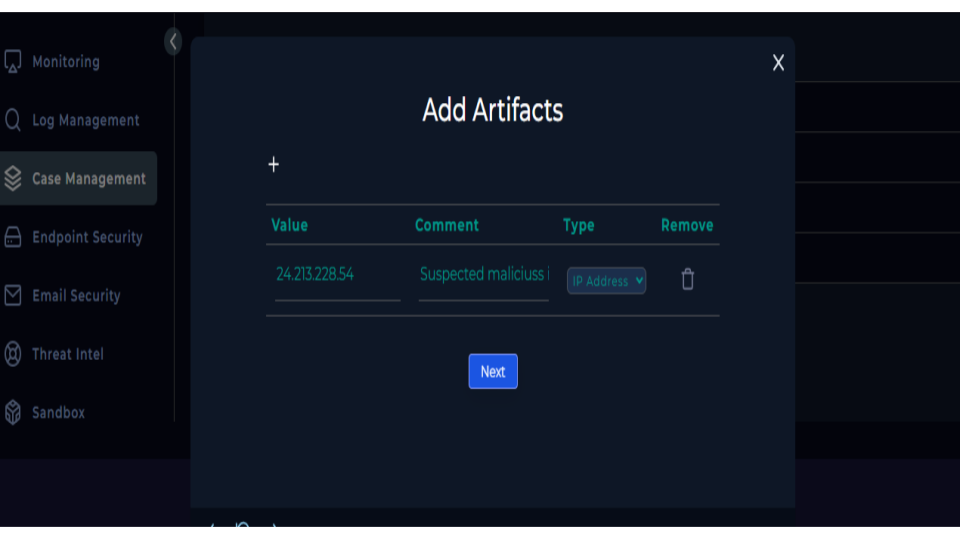
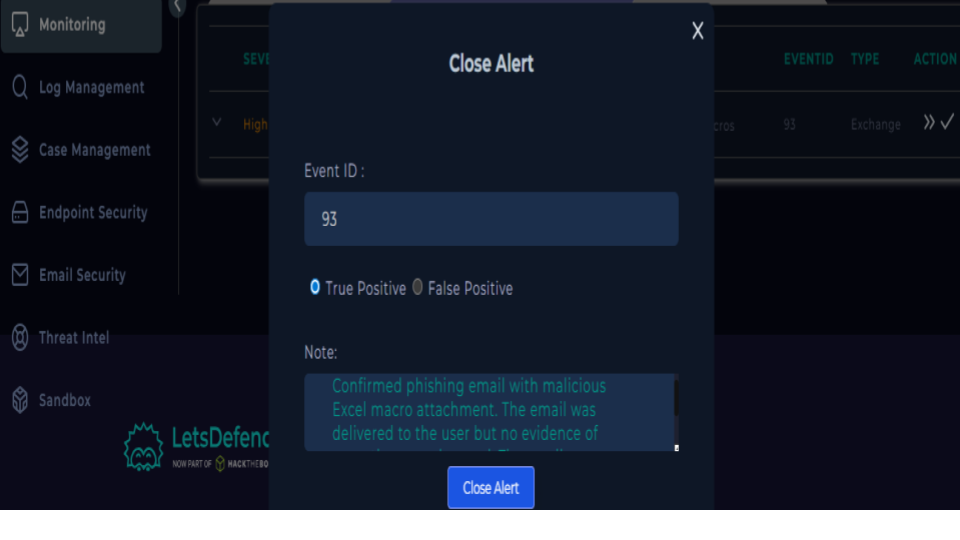

# Phishing Email Analysis – SOC Investigation (LetsDefend)

## 📌 Overview
This project documents a simulated Security Operations Center (SOC) investigation of a phishing email using the LetsDefend platform.

The objective was to analyze the email, determine if it was malicious, and follow incident response procedures to contain the threat.

---

## 🚨 Incident Summary
- Alert Type: Phishing Email
- Event ID: 93
- Severity: Medium
- Classification: True Positive

---

## 🔍 Investigation Steps

### 1. Email Analysis
- Identified presence of URL/attachment in the email
- Indicators suggested phishing behavior

### 2. URL & Attachment Analysis
- Tools Used:
  - VirusTotal
  - URLScan
  - Hybrid Analysis
- Result: Malicious indicators detected

### 3. Delivery Check
- Email was successfully delivered to the user inbox

### 4. Containment Actions
- Malicious email deleted from recipient mailbox
- Indicators (IP address) extracted and documented

### 5. User Interaction Check
- No evidence of user clicking/opening malicious link (based on logs)

---

## 🧠 Artifacts Collected
| Type        | Value          |
|------------|----------------|
| IP Address | 24.213.228.54  |

---

## 📝 Analyst Conclusion
This was a confirmed phishing attack containing malicious infrastructure. The email was delivered but no user interaction occurred. Immediate containment actions were taken by deleting the email and documenting indicators.

---

## 🛠 Skills Demonstrated
- Phishing Analysis
- Threat Intelligence
- Incident Response
- Log Analysis
- SOC Playbook Execution

### 📊 Evidence 

<h3 align="center">Phishing Alert Detection</h3>

    

<h3 align="center">Email Parsing and Initial Analysis</h3>

    

<h3 align="center">URL/Attachment Analysis</h3>

    

<h3 align="center">Containment Action</h3>

    

<h3 align="center">Artifact Collection and IOC Documentation</h3>

    

<h3 align="center">Incident Closure and Documentation</h3>

    

All screenshots are here:

🔗 [Google Slides ](https://docs.google.com/presentation/d/1BySPfyanX09Gg6k2cg3_04NkEL7L4vCUM8ozd9aG_r4/edit?usp=sharing)

## 💡 Key Takeaway
Early detection and quick response prevented potential compromise.
