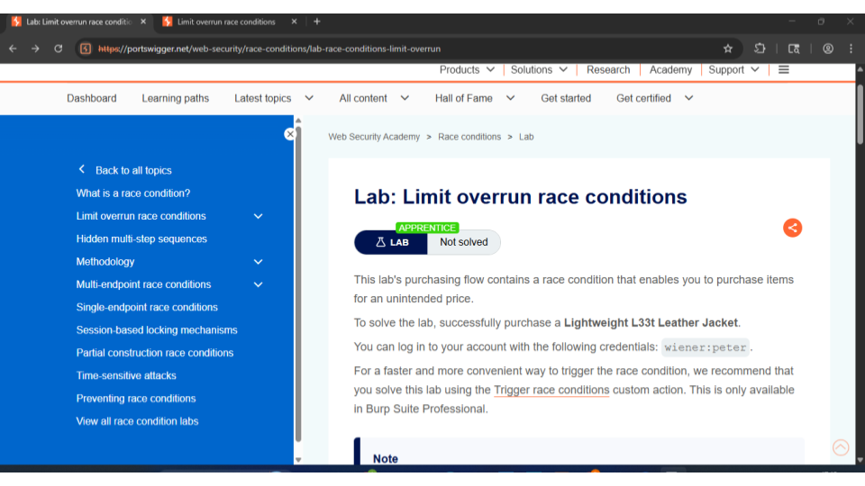
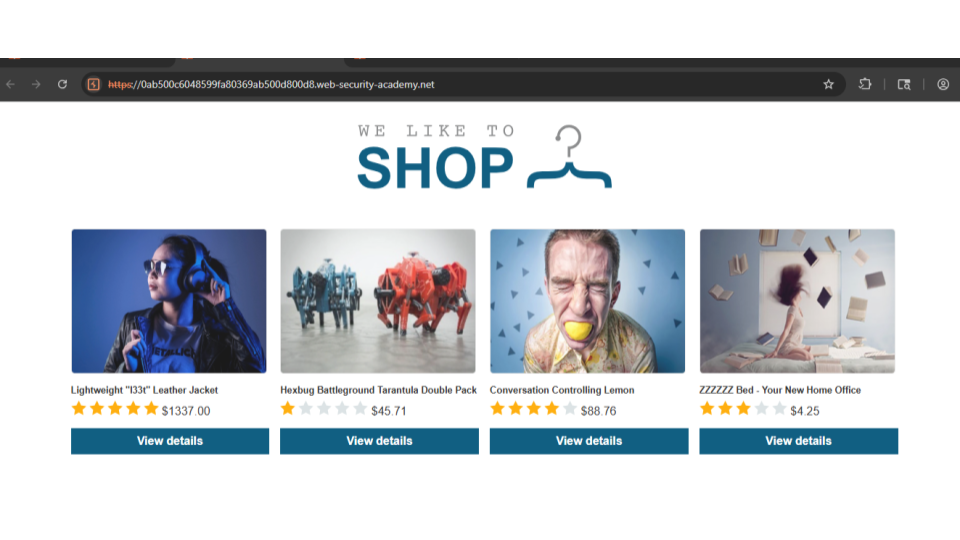
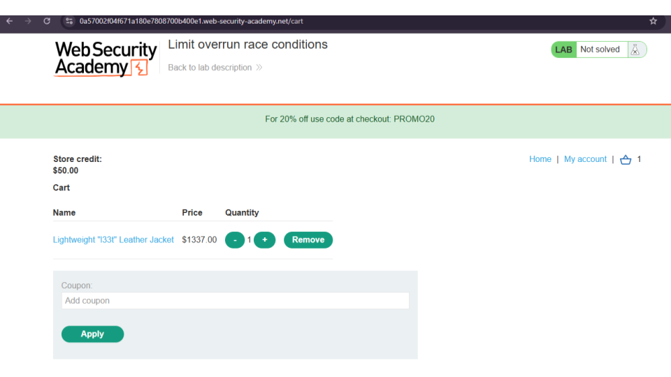
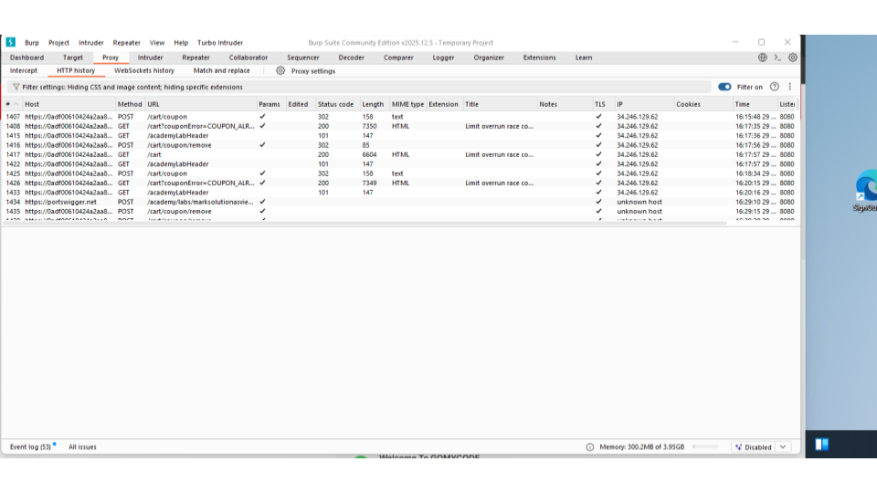
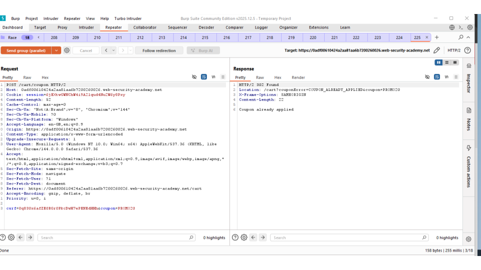
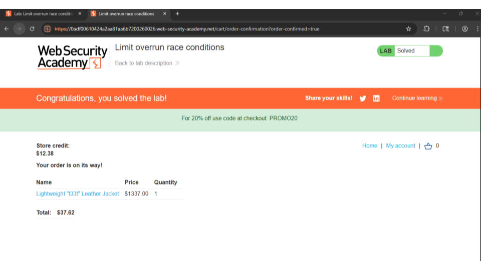

## Race Condition Exploitation – E-commerce Checkout

This project demonstrates a **limit overrun race condition** vulnerability in an e-commerce checkout process using **Burp Suite**.

### Platform
- PortSwigger Web Security Academy (Lab environment)

### Tools Used
- Burp Suite (Community Edition)
- Burp Browser

### What Was Done
- Intercepted checkout requests using Burp Suite
- Used multiple concurrent requests (19 tabs)
- Each request applied a 20% discount
- Exploited a race condition in the checkout logic
- Successfully purchased an item beyond available store credit

### Key Learning Outcomes
- Understanding race condition vulnerabilities
- Practical use of Burp Suite proxy and repeater
- Importance of server-side validation and synchronization

### 📊 Evidence 

<h3 align="center">Introduction page for the PortSwigger Web Security Academy “Limit Overrun Race Conditions” lab</h3>

    

<h3 align="center">Target Application Storefront</h3>

    

<h3 align="center">Shopping cart page showing the target item added to the cart with limited store credit available.</h3>

    

<h3 align="center">Burp Suite Proxy/HTTP history capturing multiple simultaneous requests sent to the application during testing</h3>

    

<h3 align="center">Detailed view of intercepted HTTP POST requests within Burp Suite Repeater</h3>

    

<h3 align="center">Successful completion of the “Limit Overrun Race Conditions” lab.</h3>

    

All screenshots are here:

🔗 [Google Slides](https://docs.google.com/presentation/d/1IfEtveUc_cquXE-w140IOZiFCjh5EiPVfFie8RcDoG4/edit?usp=sharing)

### Disclaimer
This project was performed in a **legal lab environment** for educational purposes only.
