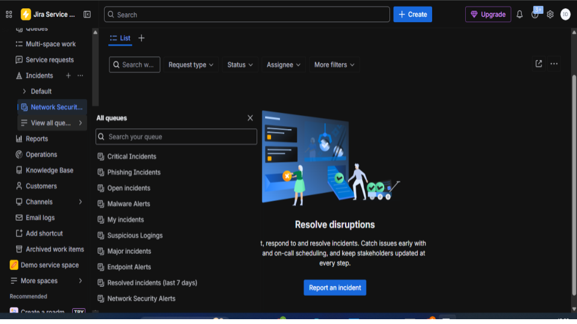
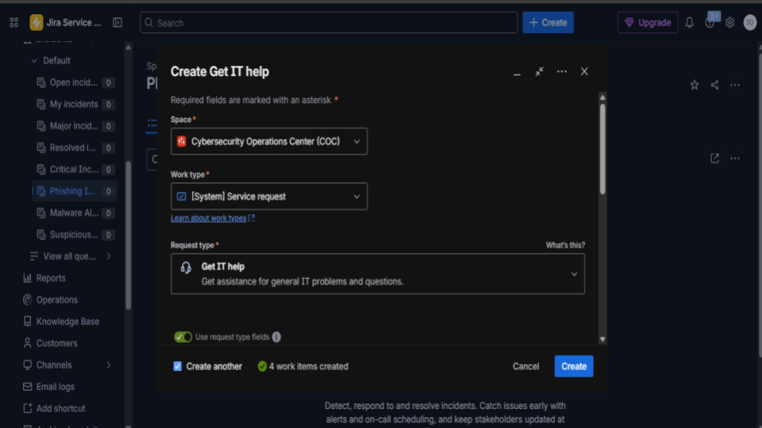
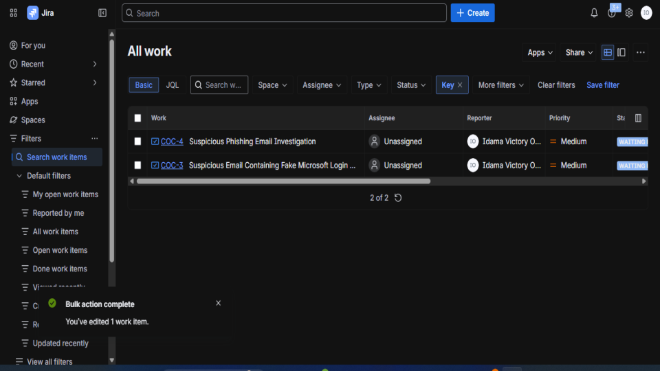
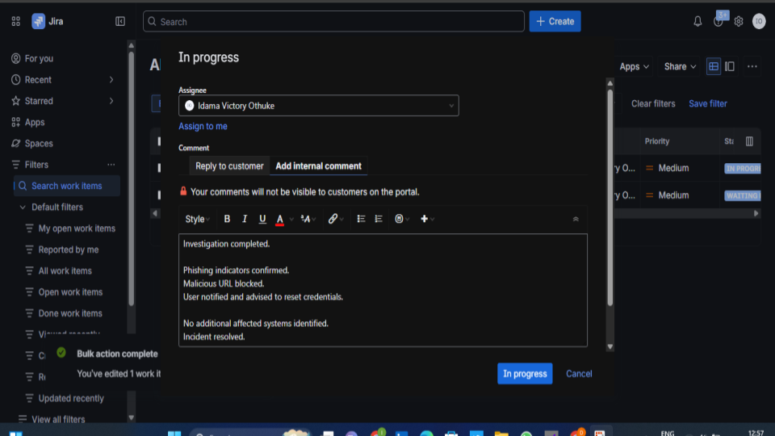
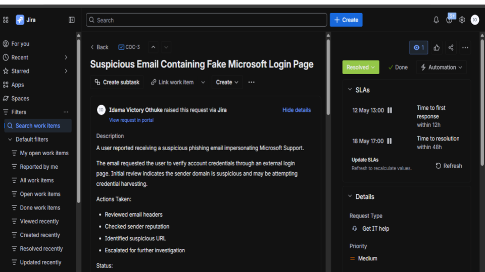

# 🛡️ SOC Ticketing & Incident Response Workflow

## 📌 Project Overview

This project demonstrates a simulated Security Operations Center (SOC) incident management workflow using a ticketing and case management platform.

The objective of this project was to practice how SOC analysts:

- Create and manage security incidents
- Track investigation progress
- Document findings and analyst actions
- Update ticket statuses throughout the incident lifecycle
- Handle phishing-related security alerts professionally
- Maintain proper SOC documentation and workflow management

This project focuses on the operational side of cybersecurity incident response and analyst case handling.

---

# 🧰 Technologies & Platforms Used

- Jira Service Management
- Incident Ticketing Workflow
- SOC Case Management
- Phishing Incident Handling
- Security Operations Processes
- Analyst Documentation Practices

# 🎯 Project Objectives

- Simulate a real-world SOC analyst workflow
- Practice incident triage and escalation
- Understand ticket lifecycle management
- Improve investigation documentation skills
- Learn how SOC teams coordinate investigations
- Demonstrate professional incident handling procedures

# 🛠️ Incident Workflow Performed

## 1️⃣ Incident Creation

Created phishing-related incident tickets including:

- Suspicious phishing email investigation
- Fake Microsoft login phishing attempt
- Malicious URL analysis case

Each ticket included:

- Incident summary
- Description of suspicious activity
- Initial findings
- Investigation notes

## 2️⃣ Ticket Assignment

Assigned incidents to the analyst account to simulate SOC ownership and case tracking

### 📊 Evidence 

<h3 align="center">Initial setup and overview page of the Jira Service Management environment configured for cybersecurity operations</h3>

    

<h3 align="center">Incident management queue displaying categorized cybersecurity tickets such as phishing incidents, malware alerts, suspicious logins, and endpoint alerts</h3>

    

<h3 align="center">Creation of a new cybersecurity service request within Jira Service Management.</h3>

    

<h3 align="center">Work item dashboard displaying created phishing investigation tickets and their assigned statuses.</h3>

    

<h3 align="center">Incident handling and response documentation within Jira</h3>

    

<h3 align="center">Detailed view of a resolved phishing investigation ticket involving a fake Microsoft login page.</h3>

    

  
All screenshots are here:
  
🔗 [Google Slides](https://docs.google.com/presentation/d/1iLdu9Wiu2B6b8vw7YxpWC0b1x7-gqw7xWxaOKXc3y9w/edit?usp=sharing)

## 🏁 Conclusion

This project helped simulate a real-world SOC environment where incidents are tracked, investigated, documented, and resolved through a professional incident management workflow.

It demonstrates foundational SOC analyst operational skills and security incident handling procedures commonly used in cybersecurity operations centers.
