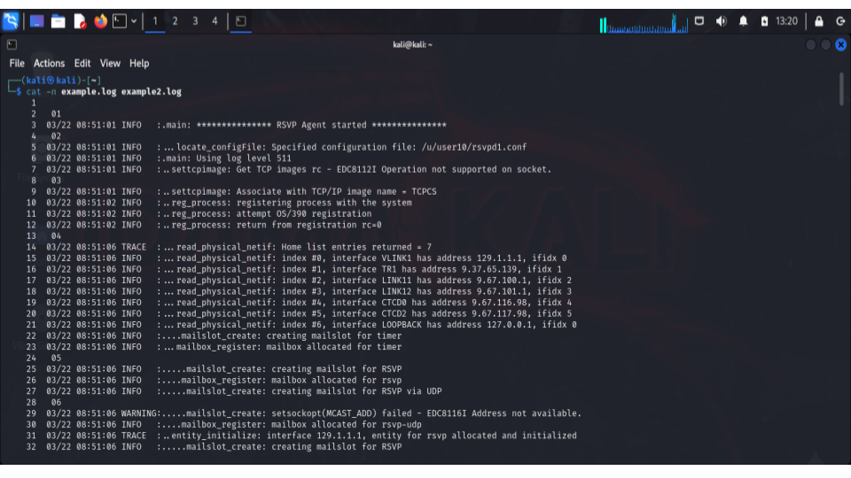
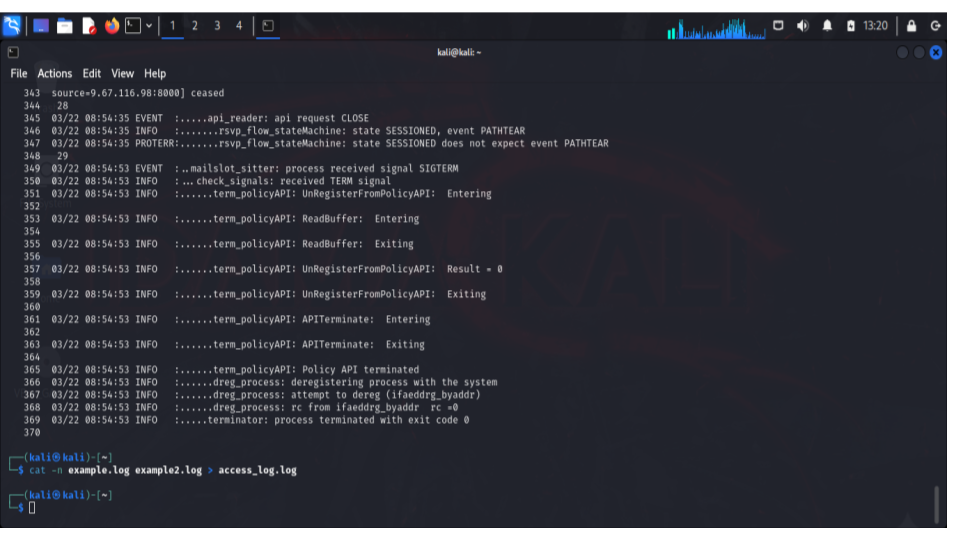
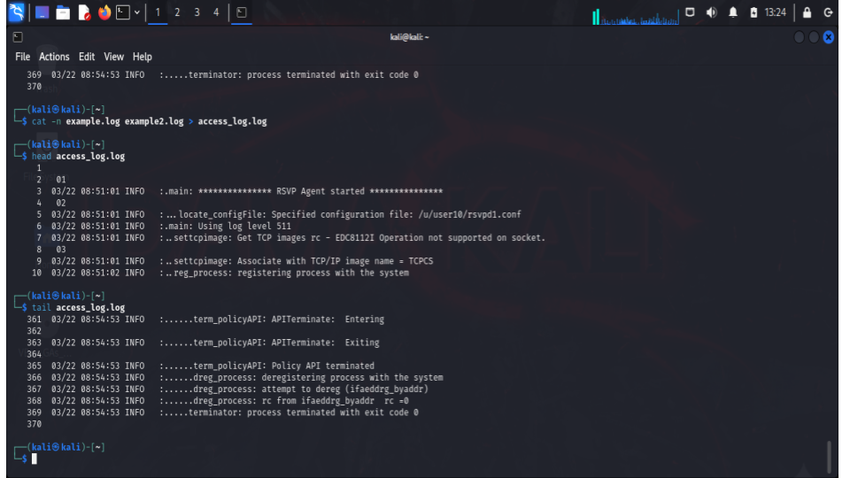
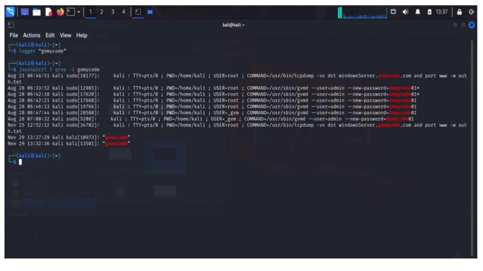
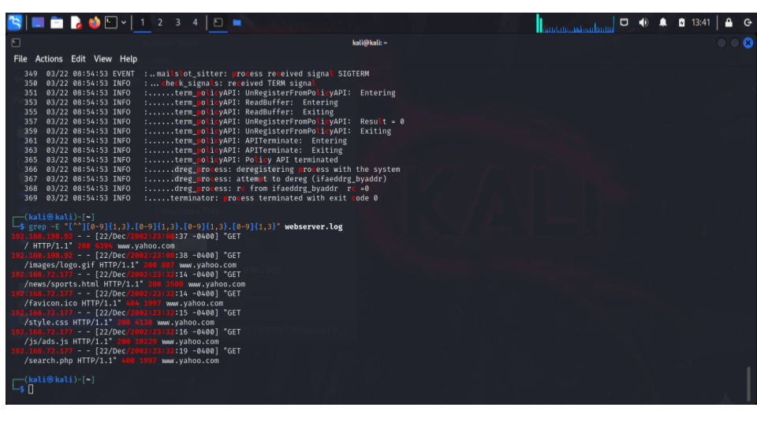

# Module 1: Introduction & Ethics

## Objective
To understand the foundations of cybersecurity and the importance of ethics in the field.

## Key Concepts Covered
- What cybersecurity is
- Types of cyber threats
- Importance of ethics and professionalism

## What I Learned
- The role of cybersecurity in protecting systems and data
- Ethical responsibilities of cybersecurity professionals
- Why integrity and compliance matter in security work

### 📊 Evidence 

<h3 align="center">Using cat command to view the files , cat -n example.log example2.log.
</h3>

    

<h3 align="center">Using redirection to save the output inside a file using this command, cat -n example.log example2.log > access_;log.log
</h3>

    

<h3 align="center">Using the head command to show the first 10 lines. And using the tail command to show the last 10 lines.
</h3>

    

<h3 align="center">Using grep command to filter the output based on value,and filtering the log file for words containing p,l,c, , using grep [plc] access_log.log.
</h3>

    

<h3 align="center">Filtering the output of the log for lines containing ip address 
</h3>

    

All screenshots are here:

🔗 [Google Slides](https://docs.google.com/presentation/d/1MN6tg1amDH5dMhWOd4kZs9ujzT3nVYaqfp7SEByjpIc/edit?usp=sharing)
 

## Summary
This module introduced me to cybersecurity fundamentals and ethical principles that guide responsible security practices.
