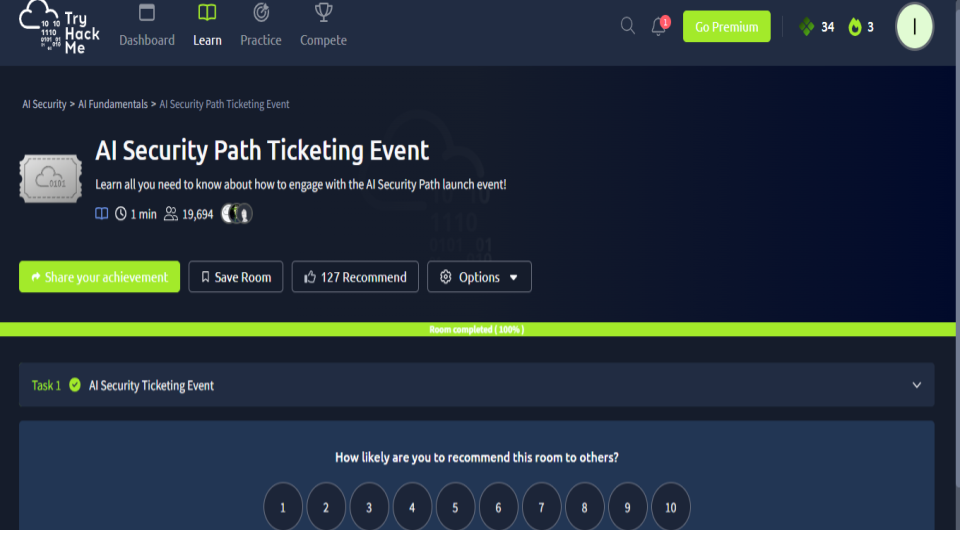
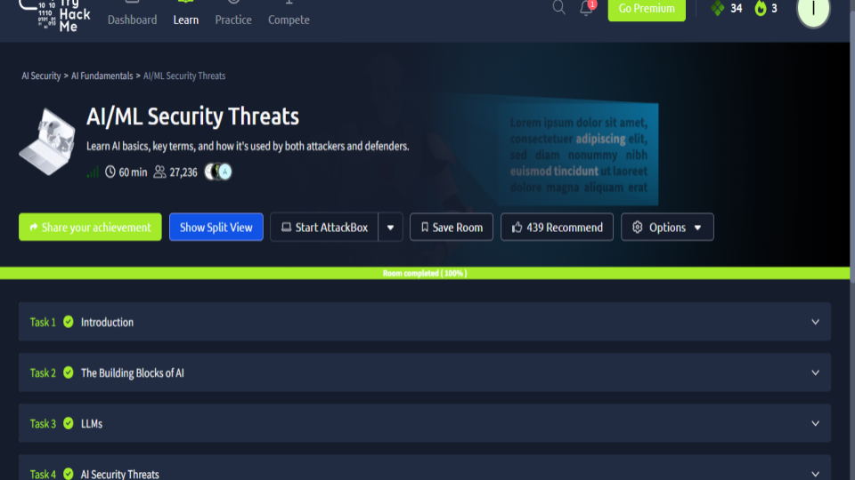
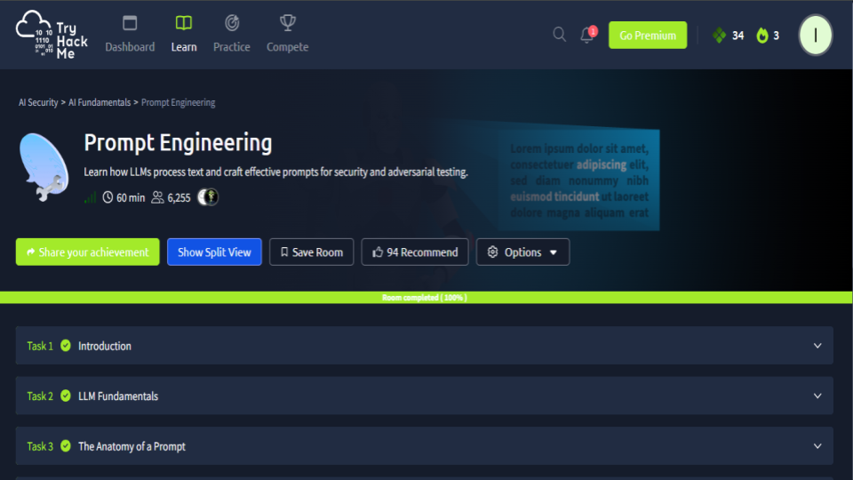
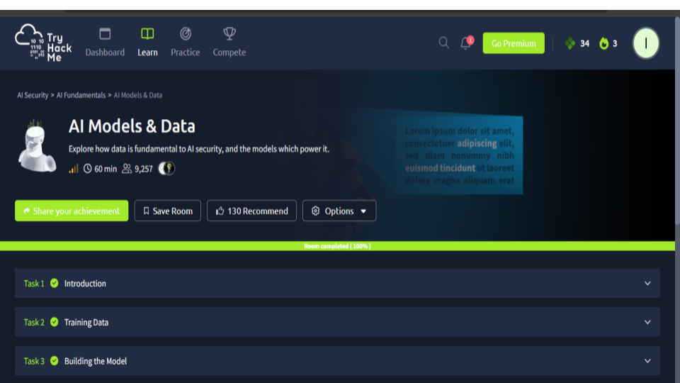
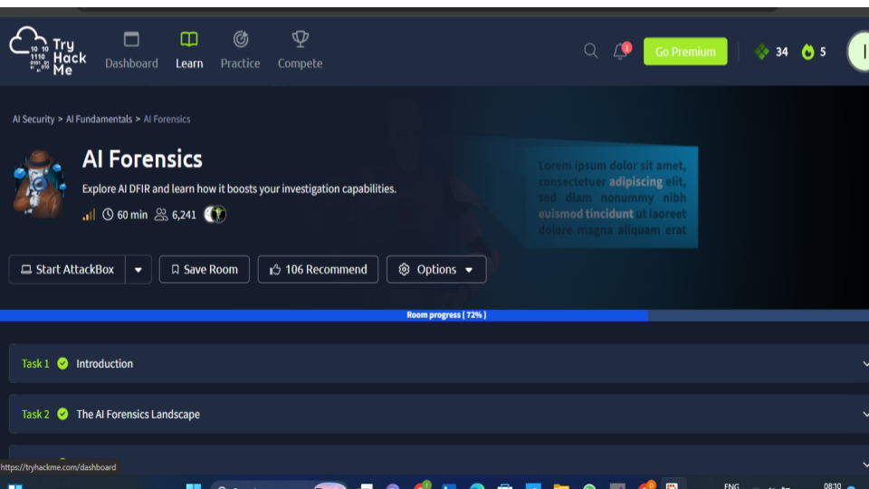

# 🛡️ AI Security Labs – TryHackMe

This section of my repository documents my hands-on learning and practical exercises in **AI Security** using TryHackMe labs.

It focuses on understanding how modern AI systems—especially Large Language Models (LLMs)—can be **attacked, abused, and secured** from a defensive security perspective.

---

## 📚 Covered Rooms

* 🎟️ AI Security Path Ticketing Event
* 🤖 AI/ML Security Threats
* 🧾 Prompt Engineering
* 📊 AI Models & Data
* 📊 AI Forensics
  

## 🎯 Skills & Knowledge Gained

Through these labs, I developed practical understanding of:

* AI/LLM attack surfaces
* Prompt injection and manipulation
* Data poisoning and model evasion
* Risks of training data exposure
* Secure usage of AI systems in real environments

---

## 🔍 Security Focus

This work is aligned with my focus on:

* 🛡️ Security Operations Center (SOC) Analysis
* 🔎 Threat Detection & Investigation
* 🤖 AI Security & Emerging Threats

---

## 🧠 Analyst Approach

Rather than only completing labs, I approach each room with an **analyst mindset**, focusing on:

* Identifying how attacks would appear in real environments
* Understanding potential impact on systems and users
* Thinking about detection, monitoring, and response strategies

### 📊 Evidence 

<h1 align="center">AI Security Path Ticketing Event</h1>

    

<h1 align="center">Completed TryHackMe room covering AI and machine learning security threats</h1>

    

<h1 align="center">TryHackMe Prompt Engineering room demonstrating how large language models process prompts and generate responses</h1>

    

<h1 align="center">Completed AI Models & Data learning module focused on the relationship between training data, machine learning models, and AI security</h1>

    

<h1 align="center">Progress within the AI Forensics room focused on AI-assisted digital forensics and incident response (DFIR)</h1>

    

* All screenshots are here:

🔗 [Google Slides – Module X](https://docs.google.com/presentation/d/163aeTisaHZ3hMHgELs4fcBOyIkgKXXdQA6_gYVwtcUY/edit?usp=sharing)

## 🚀 Continuous Learning

AI security is a rapidly evolving field. This repository will continue to be updated as I:

* Complete more advanced rooms
* Build hands-on labs (e.g., SIEM integration with AI threats)
* Expand into detection engineering and incident response

## 📌 Note

This repository is part of my broader cybersecurity portfolio, demonstrating my transition from foundational learning to applying **real-world security thinking**.

