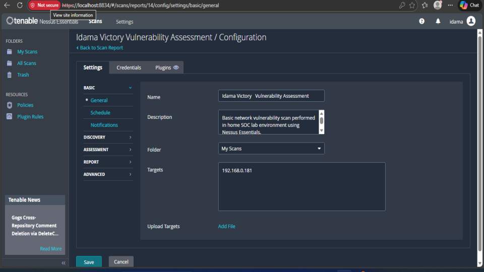
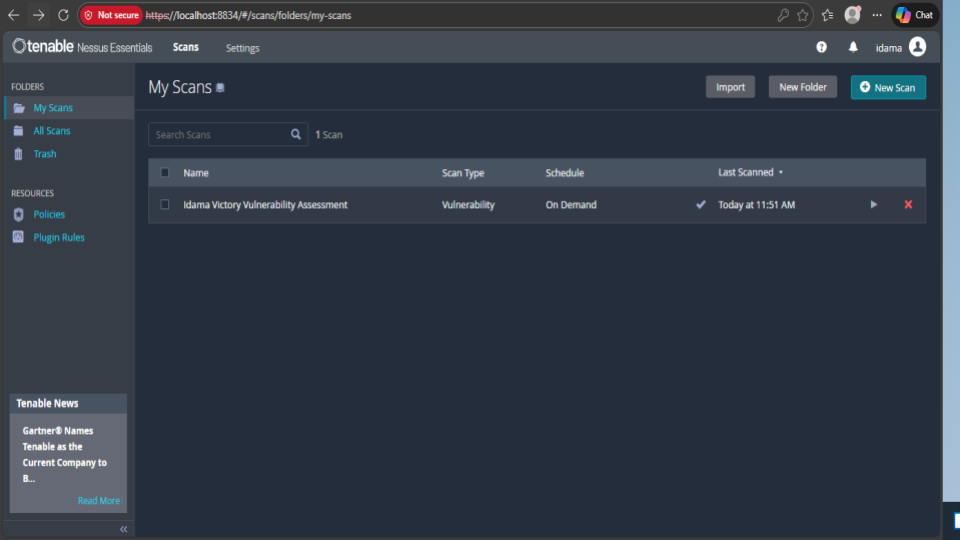
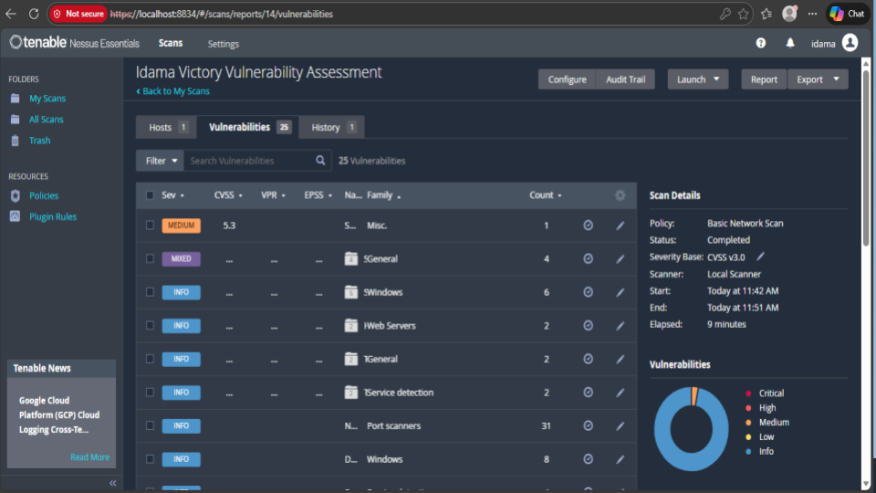
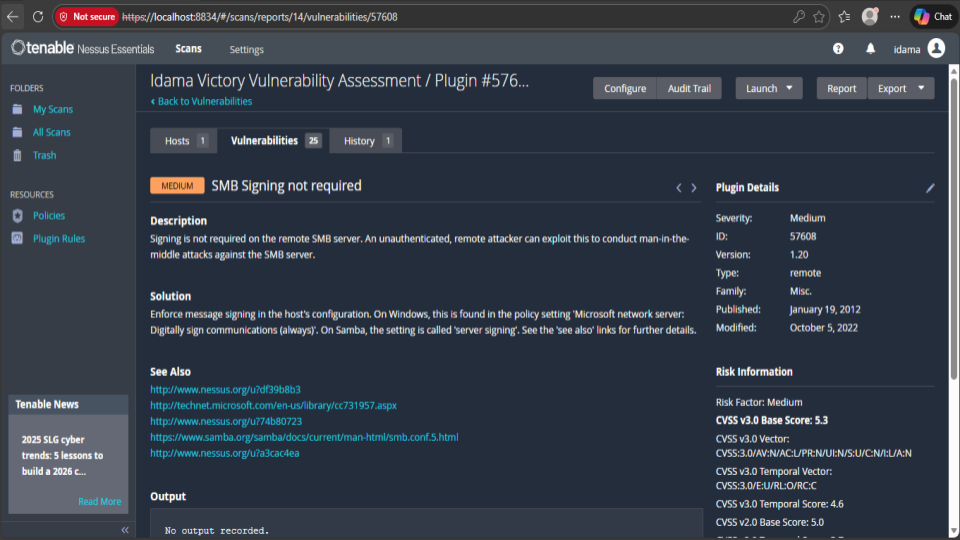

## 🛡 Windows Host Vulnerability Assessment – Nessus

## 📌 Project Overview

This project documents a vulnerability assessment performed on a Windows host using Nessus Essentials.

The objective was to identify security misconfigurations, analyze risk severity, and implement remediation controls following a structured vulnerability management workflow.

## 🎯 Objectives

Perform authenticated vulnerability scan on a Windows system

Identify and categorize vulnerabilities by severity

Analyze security impact and attack vectors

Apply remediation controls

Validate fixes through rescan

## 🔍 Key Findings

The scan identified:

1 Medium Severity Vulnerability

Multiple informational findings related to system services and configurations

Highlighted Vulnerability:

SMB Signing Not Required (Medium Risk)

This misconfiguration allows potential man-in-the-middle (MITM) attacks, where an attacker on the same network could intercept or manipulate SMB traffic.

## 🛠 Remediation Implemented

To mitigate the vulnerability:

Enabled SMB signing via Windows Group Policy

Enforced digital signing of SMB communications

Conducted a validation rescan to confirm remediation

## 🔁 Validation Process

After remediation, a rescan was performed to confirm:

SMB signing enforcement was successfully applied

No medium-severity vulnerability remained

## 🧰 Tools Used

Nessus Essentials

Windows 11 Test Machine

## 📊 Skills Demonstrated

Vulnerability Scanning

Risk Analysis

CVSS Interpretation

Windows Security Hardening

Remediation Validation

Security documentation

### 📊 Evidence 

<h3 align="center">This image shows the initial setup and configuration of a vulnerability scan within the Nessus Essentials interface</h3>

    

<h3 align="center">A view of the "My Scans" folder, displaying the status of the vulnerability assessment</h3>

    

<h3 align="center">This screenshot provides a summary of the findings for the specific host being scanned (192.168.0.181)</h3>

    

<h3 align="center">An itemized breakdown of the vulnerabilities and informational findings discovered during the assessment</h3>

    

<h3 align="center">A deep dive into a specific vulnerability identified: "SMB Signing not required</h3>

    

All screenshots are here:

🔗 [Google Slides](https://docs.google.com/presentation/d/1Co-pGfBkHOazOWdw-N57V-HMBTV90lZJ7vsnpjHK-18/edit?usp=sharing)

⚠️ Disclaimer
This project was conducted in a controlled lab environment for educational purposes only.

