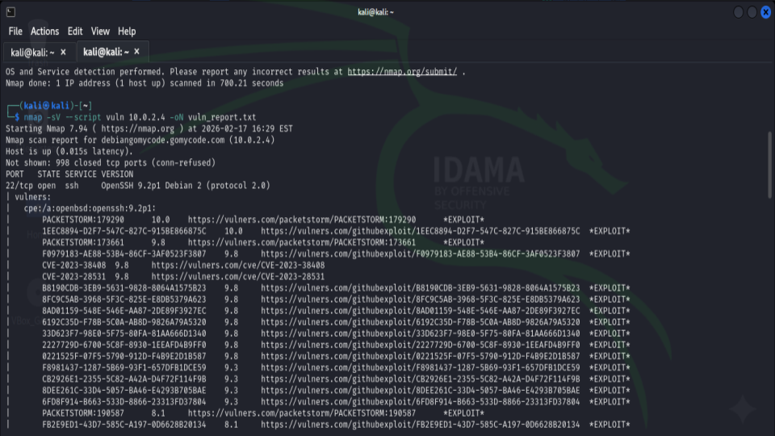
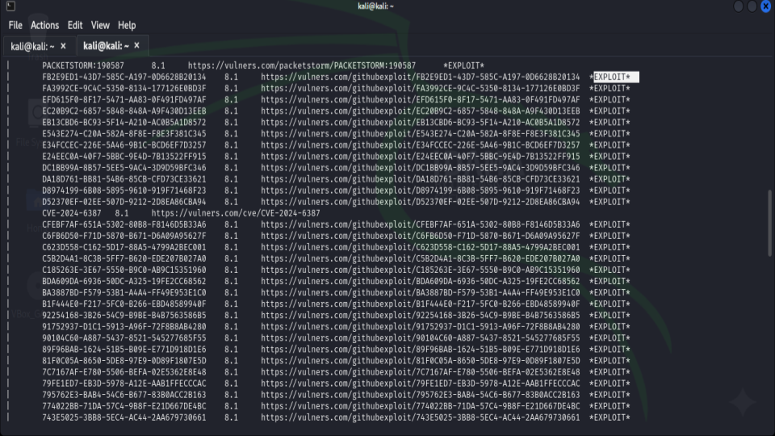
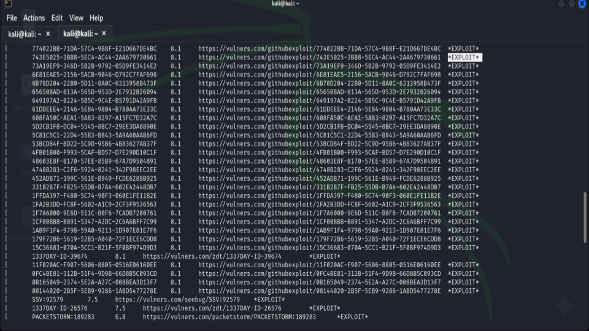
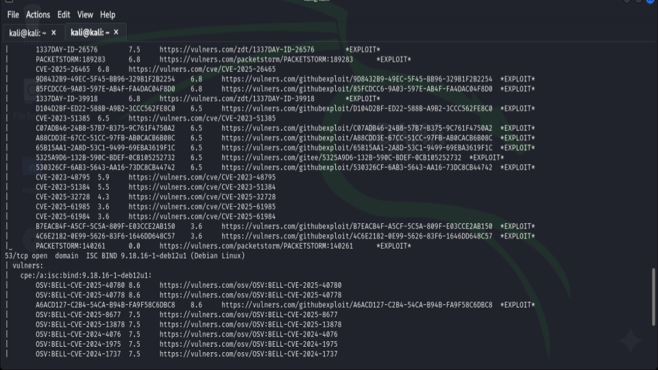
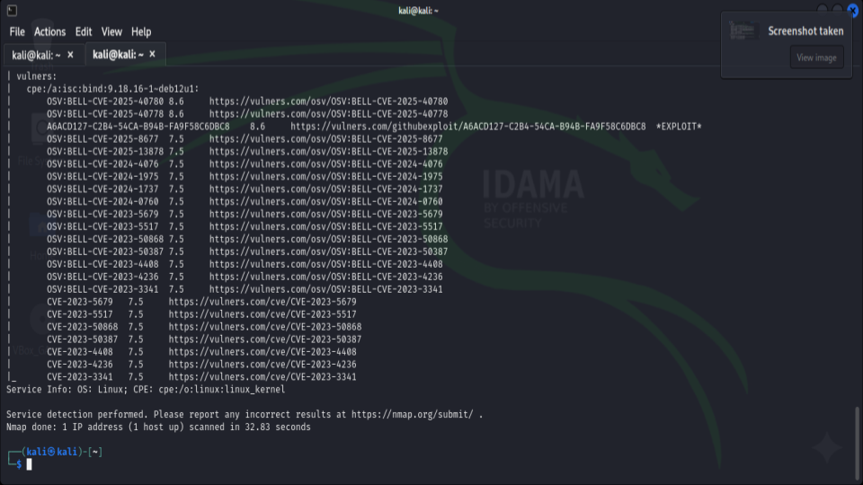

## 🔐 Debian SSH Vulnerability Assessment (Lab Project)

##📌 Project Overview
This project documents a vulnerability assessment performed against a Debian Linux virtual machine using Nmap from a Kali Linux attacker machine.
The goal was to identify exposed services, enumerate service versions, and detect known vulnerabilities using NSE vulnerability scripts.

## 🖥 Lab Environment
RoleSystemPurposeAttackerKali LinuxScanning & EnumerationTargetDebian LinuxVulnerability Assessment TargetNetworkVirtualBox Internal NetworkIsolated Lab

🛠 Tools Used

Nmap

Nmap NSE Scripts

Vulners Script

VirtualBox

## 🚀 Scan Command Used
sudo nmap -p- --script vuln 10.0.2.4 -oN vuln_report.txt

## 🔎 Scan Findings Summary

1️⃣ Open Ports Identified
PortServiceVersion22/tcpSSHOpenSSH 9.2p1 Debian

2️⃣ Detected Vulnerabilities
The vulners NSE script identified multiple CVEs associated with the detected OpenSSH version.

Multiple CVEs with CVSS scores up to 8.1

Exploit references available in public repositories

Version-based vulnerability matching

⚠️ Note: Nmap vulnerability detection is version-based and may include false positives.

## 🎯 Risk Analysis
Exposed SSH service presents:

Potential remote exploitation risk

Brute-force attack surface

Credential-based attack exposure

Public exploit references available

If the system is internet-facing, risk level increases significantly.

## 🛡 Recommended Mitigations

Disable SSH if not required

Change default SSH port

Implement key-based authentication

Disable root login

Configure firewall (UFW)

Enable Fail2Ban

Keep system updated

sudo apt update && sudo apt upgrade

## 📚 Skills Demonstrated

Network scanning

Full port enumeration

Vulnerability detection using NSE

CVE analysis

Risk assessment

Security documentation

### 📊 Evidence 

<h1 align="center">This image illustrates the initiation of an aggressive vulnerability scan using Nmap with the --script vuln flag against a target host (10.0.2.4)</h1>

    

<h1 align="center">A continuation of the Nmap scan output, showcasing a dense list of potential exploits and their corresponding vulnerability scores.</h1>

    

<h1 align="center">This further view of the terminal output displays the broad surface area of the target, listing dozens of potential exploit paths</h1>

    

<h1 align="center">The scan output reveals a second open port (53/tcp) running the ISC BIND 9.18.16 DNS service</h1>

    

<h1 align="center">The final section of the Nmap report, showing the completion of the service and OS detection phase</h1>

    

All screenshots are here:

🔗 [Google Slides](https://docs.google.com/presentation/d/1VOKAsTwqdMO9tXTssp27Uiouf3tMvTk4KApUwHunxsw/edit?usp=sharing)

⚠️ Disclaimer
This project was conducted in a controlled lab environment for educational purposes only.
